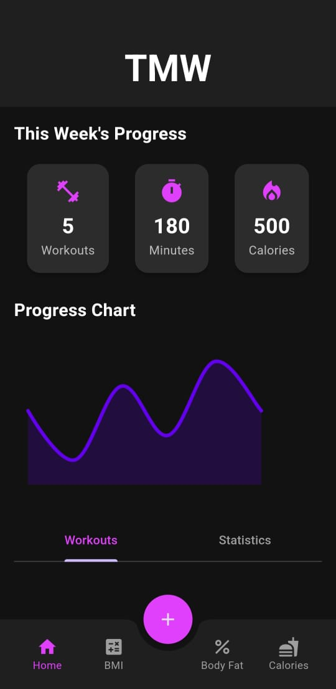
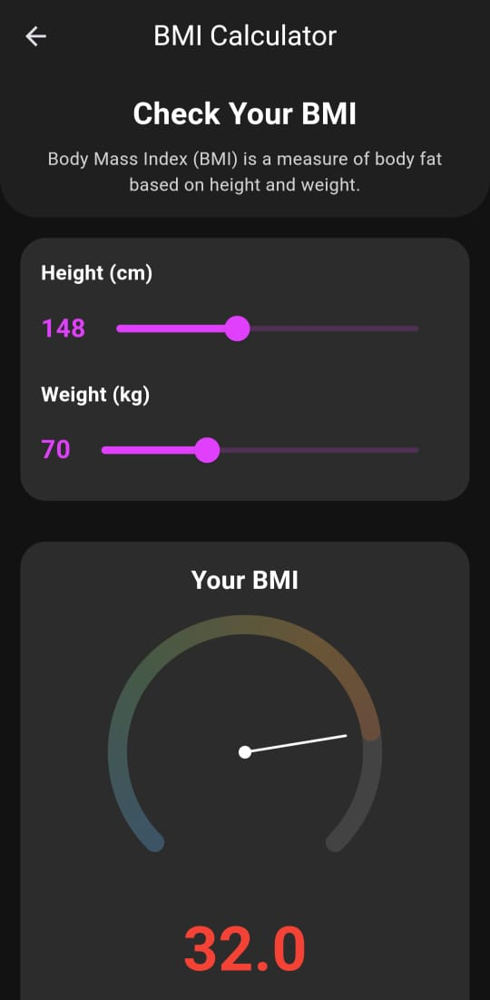
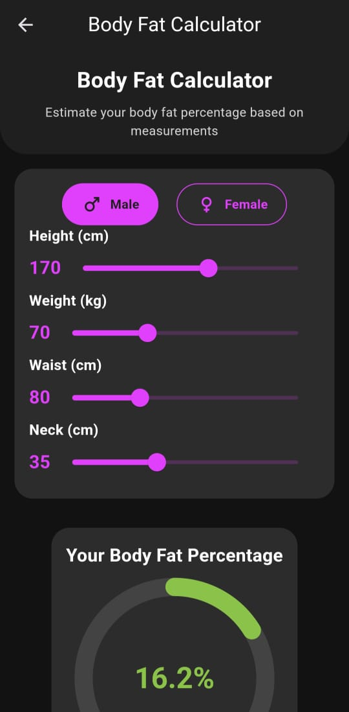
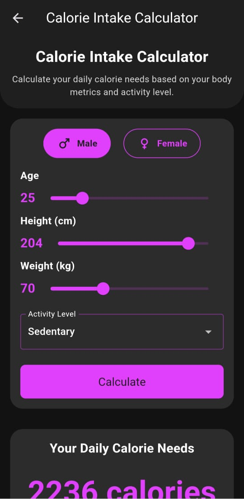

# TMW - Track My Workout

TMW (Track My Workout) is a comprehensive fitness tracking application built with Flutter. It helps users monitor their workouts, calculate BMI, estimate body fat percentage, and determine daily calorie needs.

## Features

- **Workout Tracking**: Log and manage your daily workouts.
- **BMI Calculator**: Calculate your Body Mass Index with a visual gauge.
- **Body Fat Calculator**: Estimate your body fat percentage based on various measurements.
- **Calorie Intake Calculator**: Determine your daily calorie needs based on your metrics and activity level.
- **Dark Theme**: Sleek dark mode design for comfortable use in any lighting condition.

## Screenshots

### Home Screen

*Main dashboard of the TMW app*

### BMI Calculator

*Calculate your Body Mass Index easily*

### Body Fat Calculator

*Estimate your body fat percentage*

### Calorie Intake Calculator

*Determine your daily calorie needs*

## Installation

1. Ensure you have Flutter installed on your machine. For installation instructions, see the [official Flutter documentation](https://flutter.dev/docs/get-started/install).
2. Clone this repository:
   ```
   git clone https://github.com/k1ngalph0x/TMW
   ```
3. Navigate to the project folder:
   ```
   cd TMW
   ```
4. Install dependencies:
   ```
   flutter pub get
   ```
5. Run the app:
   ```
   flutter run
   ```

## Dependencies

- flutter
- provider
- sqflite
- intl

For a full list of dependencies, see the `pubspec.yaml` file.

## Contributing

Contributions are welcome! Please feel free to submit a Pull Request.

Project Link: [https://github.com/k1ngalph0x/TMW](https://github.com/k1ngalph0x/TMW)
